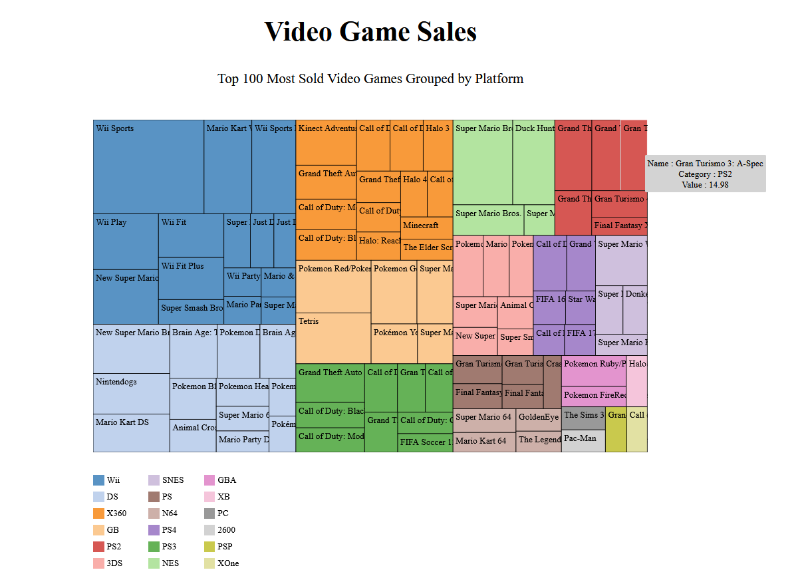
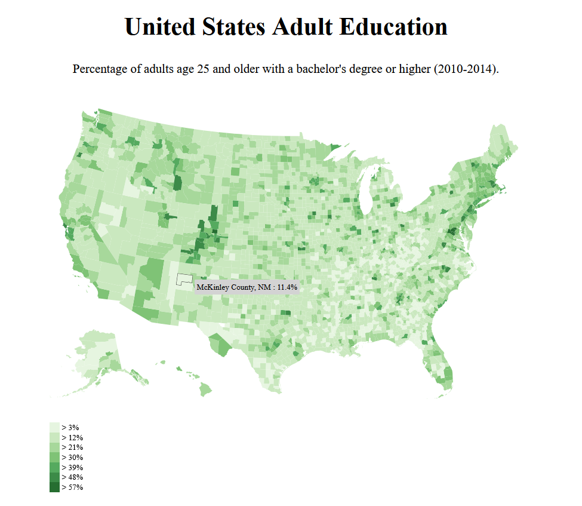
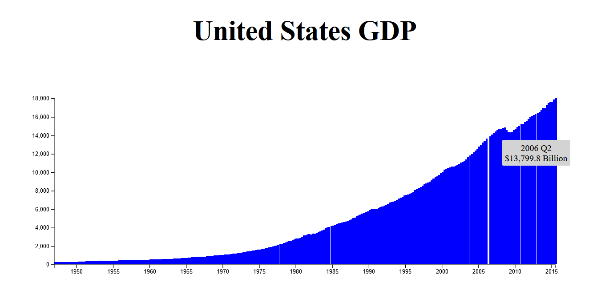
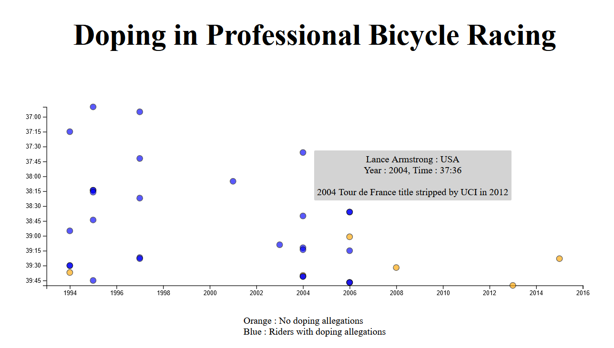
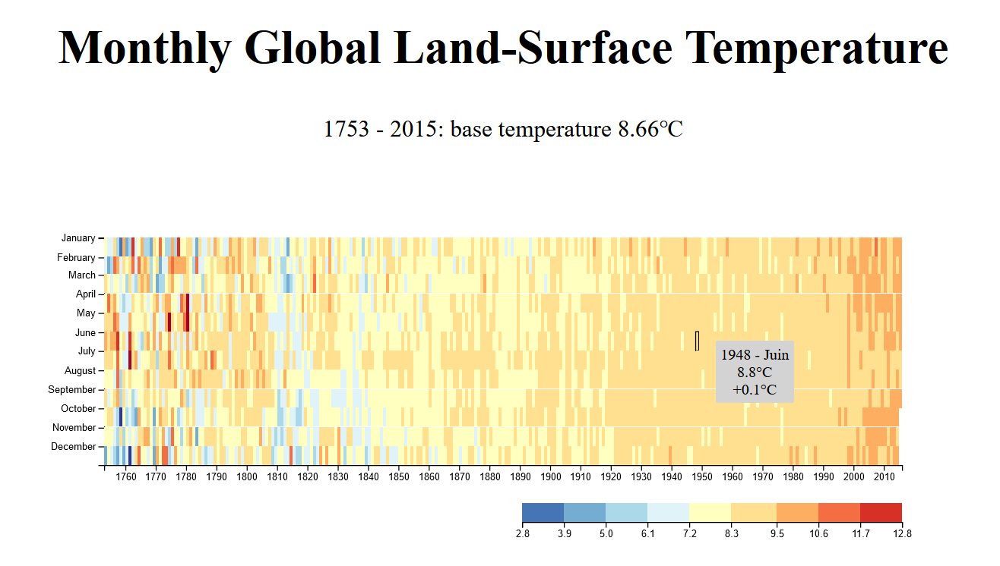

<h1 align="center">
	Tree map
</h1>

  

 

**Data :** `https://cdn.freecodecamp.org/testable-projects-fcc/data/tree_map/video-game-sales-data.json`

 

<h1 align="center">
	Choropleth map
</h1>

  

 

**Data US Education:** `https://cdn.freecodecamp.org/testable-projects-fcc/data/choropleth_map/for_user_education.json`

**Data US County:** `https://cdn.freecodecamp.org/testable-projects-fcc/data/choropleth_map/counties.json`

 

<h1 align="center">
	Bar Chart
</h1>

  

 

**Data:** `https://raw.githubusercontent.com/freeCodeCamp/ProjectReferenceData/master/GDP-data.json`

 

<h1 align="center">
	ScatterPlot Graph
</h1>

  

 

**Data:** `https://raw.githubusercontent.com/freeCodeCamp/ProjectReferenceData/master/cyclist-data.json`

 

<h1 align="center">
	Heat Map
</h1>

  

 

**Data:** `https://raw.githubusercontent.com/freeCodeCamp/ProjectReferenceData/master/global-temperature.json`
